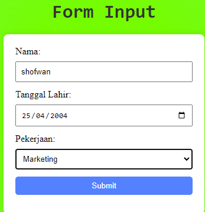
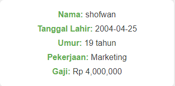

# Lab-7-Web

| Nama  | Shofwan As-Syauqi Ramadhan |
| :---- | :------------------------- |
| NIM   | 312210357                  |
| Kelas | TI.22.A4                   |

<h1 align="center"> Praktikum 7 </h1>

### Apa yang kita pelajari disini

- apa itu PHP
- Konfigurasi server
- dasar dasar PHP
- Pertanyaan dan tugas

  ***

# PHP (Hypertext Preprocessor)

PHP, atau Hypertext Preprocessor, adalah bahasa pemrograman sisi server yang umumnya digunakan untuk pengembangan web. PHP dapat disematkan ke dalam HTML dan digunakan untuk membuat halaman web dinamis. Dengan sintaks yang mirip dengan C dan Java, PHP mendukung berbagai database dan sistem operasi, menjadikannya pilihan populer untuk pengembangan aplikasi web. PHP juga memiliki berbagai pustaka dan framework, seperti Laravel dan CodeIgniter, untuk mempercepat proses pengembangan.

Berikut adalah kode dasar dalam pemrograman PHP :

```php
<?php
  $nama = "Pengguna";
  echo "Halo, $nama! Selamat datang di PHP.";
?>
```

# Konfigurasi Server

#### Konfigurasi Web Server

- Konfigurasi Apache
  Untuk konfigurasi HTTP server, seperti port yang digunakan akses HTTP, modul yang diaktifkan, lokasi document root, dll.
  Lokasi file: \xampp\apache\conf\httpd.conf
- Konfigurasi PHP
  Untuk konfigurasi perilaku engine PHP yang berpengaruh pada keamanan dan performa. Seperti batas maksimal waktu eksekusi script, batas file yang dapat diupload, error reporting, dll.
  Lokasi file: \xampp\php\php.ini
- Konfigurasi MySQL
  Konfigurasi server MySQL, seperti administrator user, port, timezone, dll.
  Lokasi file: \xampp\mysql\bin\my.ini

---

# Dasar Dasar PHP

Berikut adalah Beberapa pelajaran dasar yang dapat mengembangkan kemampuan skill dalam pemrograman PHP

## PHP Dasar

```php
<!DOCTYPE html>
<html lang="en">
<head>
 <meta charset="UTF-8">
 <title>PHP Dasar</title>
</head>
<body>
 <h1>Belajar PHP Dasar</h1>
 <?php
 echo "Hello World";
 ?>
</body>
</html>

```

## Membuat Form Input

```php
<!DOCTYPE html>
<html lang="en">
<head>
 <meta charset="UTF-8">
 <title>PHP Dasar</title>
</head>
<body>
<h2>Form Input</h2>
<form method="post">
 <label>Nama: </label>
 <input type="text" name="nama">
 <input type="submit" value="Kirim">
</form>
<?php
echo 'Selamat Datang ' . $_POST['nama'];
?>
</body>
</html>

```

## Operator

```php
<?php
$gaji = 1000000;
$pajak = 0.1;
$thp = $gaji - ($gaji*$pajak);
echo "Gaji sebelum pajak = Rp. $gaji <br>";
echo "Gaji yang dibawa pulang = Rp. $thp";
?>
```

## Kondisi IF

```php
<?php
$nama_hari = date("l");
if ($nama_hari == "Sunday") {
 echo "Minggu";
} elseif ($nama_hari == "Monday") {
 echo "Senin";
} else {
 echo "Selasa";
}
?>
```

## Kondisi Switch

```php
<?php
$nama_hari = date("l");
switch ($nama_hari) {
 case "Sunday":
 echo "Minggu";
 break;
 case "Monday":
 echo "Senin";
 break;
case "Tuesday":
 echo "Selasa";
 break;
 default:
 echo "Sabtu";
}
?>
```

## Perulangan for

```php
<?php
echo "Perulangan 1 sampai 10 <br />";
for ($i=1; $i<=10; $i++) {
 echo "Perulangan ke: " . $i . '<br />';
}
echo "Perulangan Menurun dari 10 ke 1 <br />";
for ($i=10; $i>=1; $i--) {
 echo "Perulangan ke: " . $i . '<br />';
}
?>
```

## Perulangan while

```php
<?php
echo "Perulangan 1 sampai 10 <br />";
$i=1;
while ($i<=10) {
 echo "Perulangan ke: " . $i . '<br />';
 $i++;
}
?>
```

## Perulangan dowhile

```php
<?php
echo "Perulangan 1 sampai 10 <br />";
$i=1;
do {
 echo "Perulangan ke: " . $i . '<br />';
 $i++;
} while ($i<=10);
?>

```

---

# Pertanyaan Dan Tugas

Buatlah program PHP sederhana dengan menggunakan form input yang menampilkan
nama, tanggal lahir dan pekerjaan. Kemudian tampilkan outputnya dengan menghitung
umur berdasarkan inputan tanggal lahir. Dan pilihan pekerjaan dengan gaji yang
berbeda-beda sesuai pilihan pekerjaan.

Berikut adalah Hasil program diatas :





# Terimakasih
